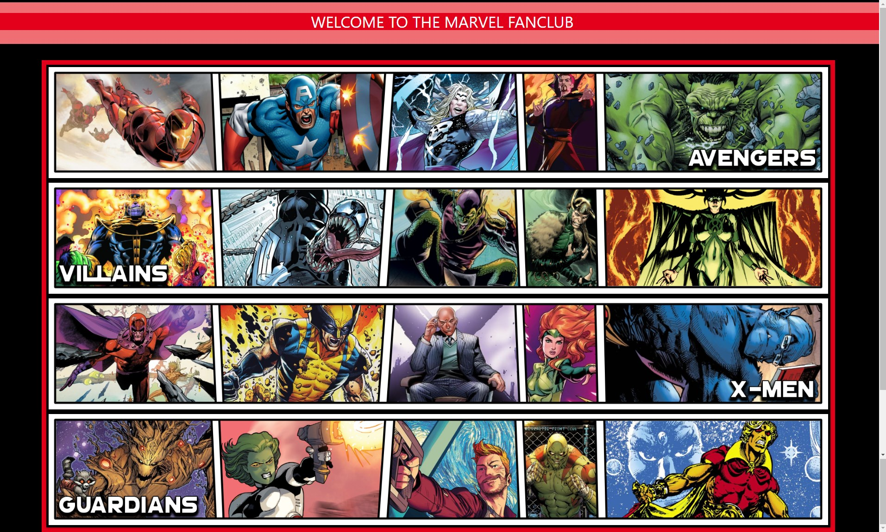
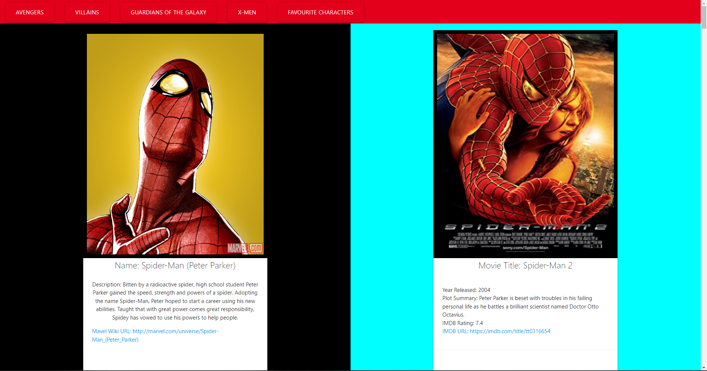
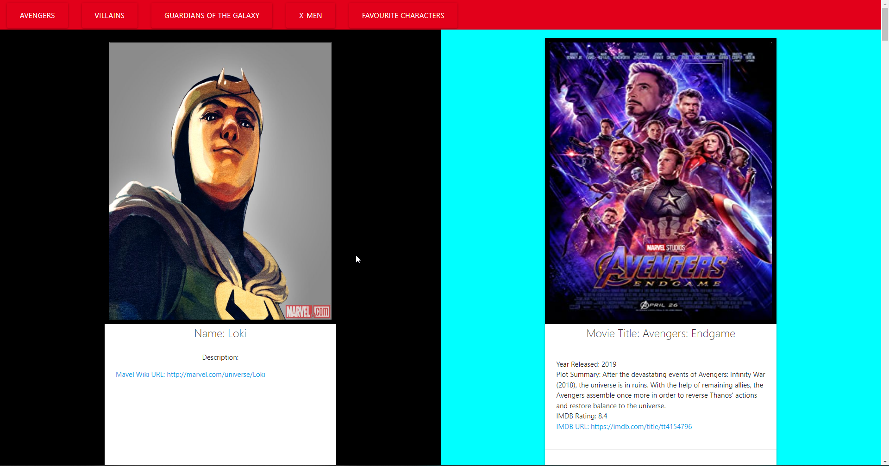

# 1st Major Project: Michael Ariti, Hannah Allison-Batt, Mohamed Attia

## Marvel Media Hub

The purpose of this repository is to create an interactive website that allows the user to find movies to be able to watch featuring their chosen character. Currently featuring a large, but limited selection of characters across 4 Marvel groups, including X-Men, Avengers, Villains & Guardians of the Galaxy.

## Features

1. A Landing page with clickable images allowing the user to select which group of Marvel characters they want to look through.
2. An animated transition to each team page.
3. Api requests are sent based on the users selection and then the data is displayed aesthetically on the team page
4. Each Character will load in on a card, with a corresponding 'random' movie card loaded next to them (Movie is guaranteed to feature the character)
5. The ability to add Characters to a custom favourites list
6. Favourite heroes are stored in localStorage and have their own teampage.

## File Directory

You will find the index.html next to this readme, which is the finished website code.

In the assets folder you will find 

1. The css style sheet for the index.html
2. The screenshots of the finished website which is pictured below.
3. The javascript used to run the fanpage.
4. The images used in the project.

## Secreenshots

## Webpage URL
[Marvel-Project-URL](https://hannahab777.github.io/Marvel-Fan-Site/)

### End

Hannah Allison-Batt, Mohamed Attia, Michael Ariti 2022

